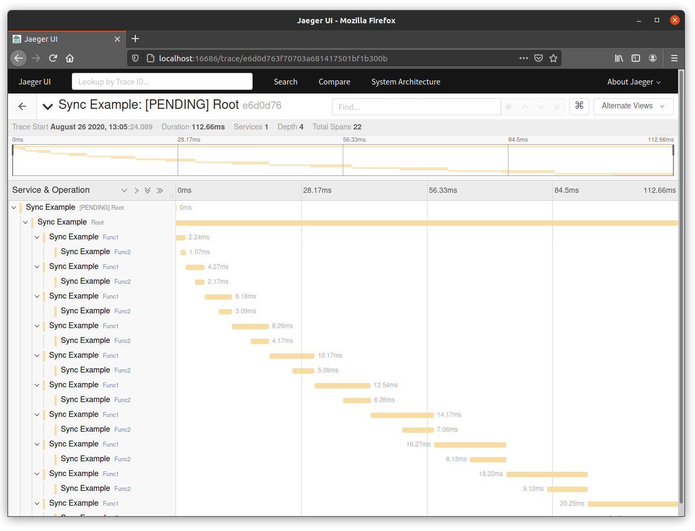
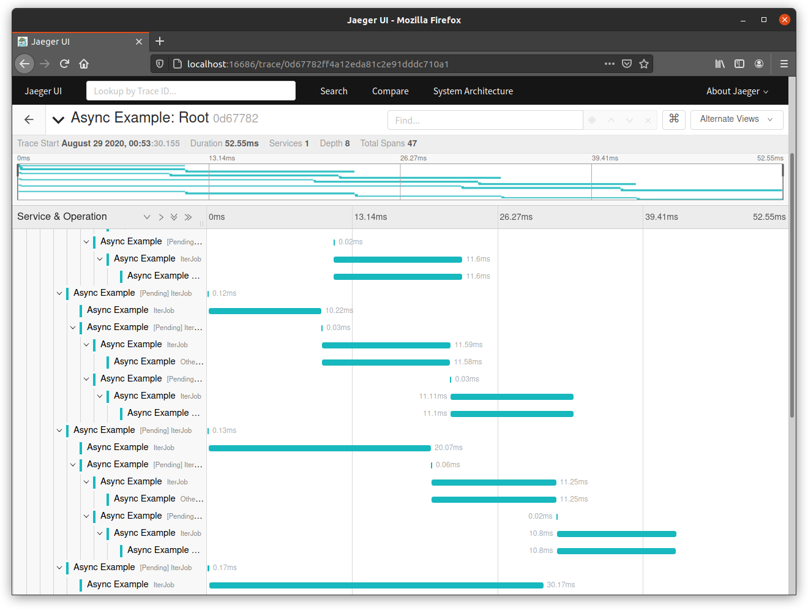

# Minitrace
[](https://github.com/tikv/minitrace-rust/actions)
[](https://github.com/tikv/minitrace-rust/blob/master/LICENSE)

A high-performance, ergonomic timeline tracing library for Rust.


## Concepts

### Span

  A `Span` represents an individual unit of work done. It contains:
  - An operation name
  - A start timestamp and finish timestamp
  - A set of key-value properties
  - A reference to a causally-related `Span`

  To record such a span, a struct of the same name, `Span`, is provided. Its lifetime indicates the begin and the end
  of the span.

  A new `Span` can be created via `Span::root()`, `Span::from_parent()` and `Span::from_parents()`, and the last two
  methods refer existing related `Span`s to the new `Span`.

  `Span`s are thread-safe and can be sent and accessed across threads.


### Collector

  A `Collector` associated to a root `Span` is used to collect all spans related to a request.


### Local Span & Local Span Guard

  Cooperate with `LocalCollector`, `LocalSpan` provides an extremely low-cost tracing mechanism for performance-sensitive
  apps.
  
  A `LocalSpan` is recorded by a `LocalSpanGuard` which is thread-local and created via method `LocalSpan::enter()`.
  A `LocalSpanGuard`'s creation means a `LocalSpan`'s begin and its destruction means a `LocalSpan`'s end. A completed
  `LocalSpan` will be finally stored in thread local.

  The causally-relation between `LocalSpan`s is built implicitly. It doesn't need to explicitly pass any contexts to connect
  two `LocalSpan`s. Even within a deeply nested function calls, the inner `LocalSpanGuard` can automatically figure out
  its parent.


### Local Collector

  `LocalCollector` is provided to retrieve `LocalSpan`s from thread local. Such collected `LocalSpan`s can be mounted to a
  normal `Span`.
  
  At most time, we should use the thread-local tracing mechanism (i.e `LocalSpan` and `LocalCollector`) to achieve the high
  performance goal. In other situations where execution is crossing thread bound, and a `Span` has to be passed from one
  thread to another thread, we just need to simply mount `LocalSpan`s, which is collected by different `LocalCollector`s,
  to the `Span`.


## Usage

```toml
[dependencies]
minitrace = { git = "https://github.com/tikv/minitrace-rust.git" }
```

### Record a Span

To record a common span:
```rust
use minitrace::*;

let _span_guard = LocalSpan::enter("my event");
```

To add properties:

```rust
use minitrace::*;

// add a property for a span
let _span_guard = LocalSpan::enter("my event").with_property(|| ("key", String::from("value")));

// or add multiple properties for a span
let _span_guard = LocalSpan::enter("my event").with_properties(|| {
    vec![
        ("key1", String::from("value1")),
        ("key2", String::from("value2")),
    ]
});
```

###  Synchronous Example

A common pattern to trace synchronous code:

- Create a root `Span` and a `Collector` via `Span::root()`, then attach the `Span` to the current thread.
- Add `LocalSpan::enter()`s somewhere, e.g. at the beginning of a code scope, at the beginning of a function, to record spans.
- Make sure the root `Span` and all guards are dropped, then call `Collector`'s `collect` to get all `Span`s.


```rust
use minitrace::*;

let collector = {
    let (root_span, collector) = Span::root("root");
    let _span_guard = root_span.enter();

    let _local_span_guard = LocalSpan::enter("child");

    // do something ...

    collector
};

let spans: Vec<span::Span> = collector.collect();
```

### Asynchronous Example

To trace asynchronous code, we usually transmit `Span` from one thread to another thread.

#### Threads

```rust
use minitrace::*;

let collector = {
    let (root_span, collector) = Span::root("task1");
    let _span_guard = root_span.enter();

    let _local_span_guard = LocalSpan::enter("span of task1");
    
    // To trace a child task
    let span = Span::from_local_parent("task2");
    std::thread::spawn(move || {
        let _span_guard = span.enter();

        let _loal_span_guard = Span::enter("span of also task2");
    });

    collector
};

let spans: Vec<span::Span> = collector.collect();
```

#### Futures

We provide two `Future` adaptors:

- `in_local_span`: call `LocalSpan::enter` at every poll
- `in_span`: wrap the `Future` with a `Span`, then call `Span::try_enter` at every poll

The `in_span` adaptor is commonly used on a `Future` submitting to a runtime.

```rust
use minitrace::*;

let collector = {
    let (root_span, collector) = Span::root("root");
    let _span_guard = root_span.enter();

    // To trace another task
    runtime::spawn(async {
        let _ = async {
            // some works
        }.in_local_span("");
    }.in_span(Span::from_local_parent("new task")));

    collector
};

let spans: Vec<span::Span> = collector.collect();
```

### Macros

We provide two macros to help reduce boilerplate code:

- trace
- trace_async

For normal functions, you can change:
```rust
use minitrace::*;

fn amazing_func() {
    let _span_guard = LocalSpan::enter("wow");

    // some works
}
```
to
```rust
use minitrace::*;
use minitrace_macro::trace;

#[trace("wow")]
fn amazing_func() {
    // some works
}
```

For async functions, you can change:
```rust
use minitrace::*;

async fn amazing_async_func() {
    async {
        // some works
    }
    .in_local_span("wow")
    .await
}
```
to
```rust
use minitrace::*;
use minitrace_macro::trace_async;

#[trace_async("wow")]
async fn amazing_async_func() {
    // some works
}
```

To access these macros, a dependency should be added as:

```toml
[dependencies]
minitrace-macro = { git = "https://github.com/tikv/minitrace-rust.git" }
```

## User Interface

We support visualization provided by an amazing tracing platform [Jaeger](https://www.jaegertracing.io/).

To experience, a dependency should be added as:
               
```toml
[dependencies]
minitrace-jaeger = { git = "https://github.com/tikv/minitrace-rust.git" }
```

### Report to Jaeger

```rust
use minitrace_jaeger::Reporter;

let spans = /* collect from a collector */;

let socket = SocketAddr::new("127.0.0.1:6831".parse().unwrap());
let reporter = Reporter::new(socket, "service name");

const TRACE_ID: u64 = 42;
const SPAN_ID_PREFIX: u32 = 42;
const ROOT_PARENT_SPAN_ID: u64 = 0;
reporter.report(TRACE_ID, SPAN_ID_PREFIX, ROOT_PARENT_SPAN_ID, &spans).expect("report error");
```

### Setup Jaeger
```sh
docker run --rm -d -p6831:6831/udp -p16686:16686 --name jaeger jaegertracing/all-in-one:latest
```

### Run Synchronous Example

```sh
cargo run --example synchronous
```

Open http://localhost:16686 to see the results.



### Run Asynchronous Example

```sh
cargo run --example asynchronous
```

Open http://localhost:16686 to see the results.


