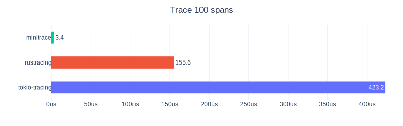
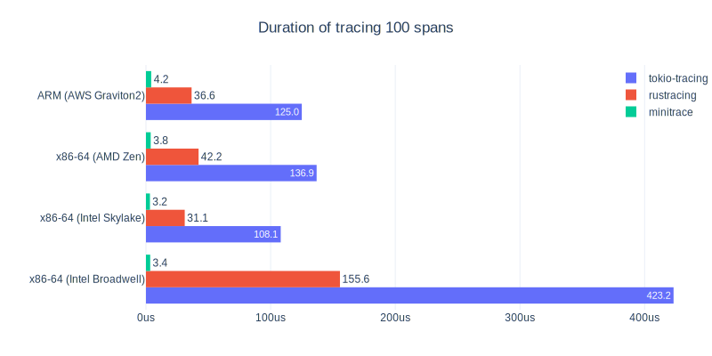
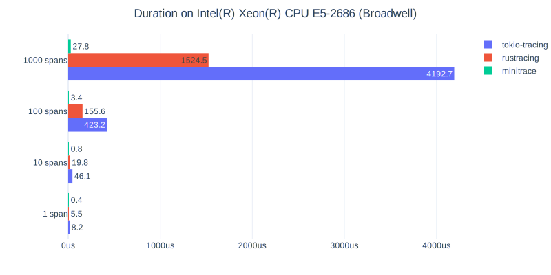

  

  
  
  
  
  

 

Minitrace is a Rust tracing library [10~100x faster](#benchmarks) than others:

Features:

- [Extremely fast](#benchmarks)
- Compatible with [OpenTracing] and [OpenTelemetry]
- [Jaeger] and [Datadog] reporter

## Resources

- [Docs]
- [Getting Started]
- [Examples]
- [FAQ](#faq)

## Benchmarks

**By different architectures:**

|                      | x86-64 (Intel Broadwell) | x86-64 (Intel Skylake) | x86-64 (AMD Zen) | ARM (AWS Graviton2) |
|----------------------|--------------------------|------------------------|------------------|---------------------|
| tokio-tracing        | 124x slower              | 33x slower             | 36x slower       | 29x slower          |
| rustracing           | 45x slower               | 10x slower             | 11x slower       | 9x slower           |
| minitrace (baseline) | 1x (3.4us)               | 1x (3.2us)             | 1x (3.8us)       | 1x (4.2us)          |

**By creating different number of spans:**

|                      | 1 span      | 10 spans   | 100 spans   | 1000 spans  |
|----------------------|-------------|------------|-------------|-------------|
| tokio-tracing        | 19x slower  | 61x slower | 124x slower | 151x slower |
| rustracing           | 13x slower  | 26x slower | 45x slower  | 55x slower  |
| minitrace (baseline) | 1x (0.4us)  | 1x (0.8us) | 1x (3.4us)  | 1x (27.8us) |

Detailed results are available in [etc/benchmark-result](etc/benchmark-result).

## Projects using minitrace

Feel free to open a PR and add your projects here:

- [TiKV](https://github.com/tikv/tikv): A distributed transactional key-value database

## FAQ

### Why is minitrace so fast?

There are some articles posted by the maintainer of minitrace:

- [The Design of A High-performance Tracing Library in Rust (Chinese)](https://www.youtube.com/watch?v=8xTaxC1RcXE)
- [How We Trace a KV Database with Less than 5% Performance Impact](https://en.pingcap.com/blog/how-we-trace-a-kv-database-with-less-than-5-percent-performance-impact/)

### Why / What's the difference compared to 'X'?

Most tracing libraries aims to provide more features, while minitrace always prioritize performance. Usually minitrace only provides basic and common tracing features.

### Will you support OpenTelemetry feature 'X'?

Minitrace is focused on high performance tracing only. You can open an issue for the missing tracing features you want to have.

Note that we always prioritize performance over features, so that not all tracing feature requests may be accepted. 

### What's the status of this library?

**API Unstable**: The API is not stabilized yet, may be changed in the future. 

**Code base Tested**: Minitrace has been tested with high coverage. However, applications utilizing minitrace have not been widely deployed, so that minitrace is currently **NOT** regarded as battle-tested. 

[Docs]: https://docs.rs/minitrace/
[Getting Started]: minitrace/examples/get_started.rs
[Examples]: minitrace/examples
[OpenTracing]: https://opentracing.io/
[OpenTelemetry]: https://opentelemetry.io/
[Jaeger]: https://crates.io/crates/minitrace-jaeger
[Datadog]: https://crates.io/crates/minitrace-datadog
