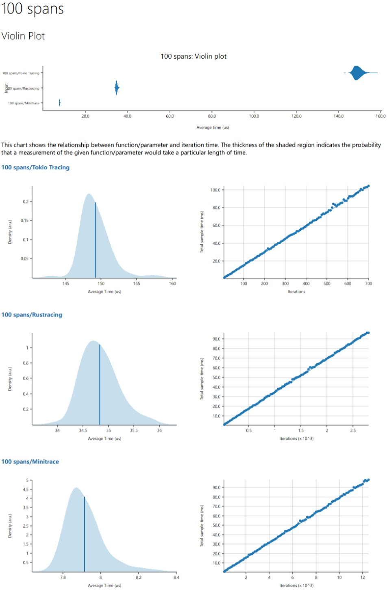

# minitrace

[](https://github.com/tikv/minitrace-rust/actions)
[](https://docs.rs/minitrace/)
[](https://crates.io/crates/minitrace)
[](https://github.com/tikv/minitrace-rust/blob/master/LICENSE)

A high-performance and ergonomic timeline tracing library for Rust. Builtin supports [Jaeger](https://www.jaegertracing.io/) and [Datadog](https://www.datadoghq.com/).

## Usage

```toml
[dependencies]
minitrace = "0.2"
minitrace-jaeger = "0.2"
```

```rust
use minitrace::prelude::*;

let (root, collector) = Span::root("root");

{
    let _child_span_1 = Span::enter_with_parent("child span 1", &root);
    // some work
}

drop(root);
let records: Vec<SpanRecord> = collector.collect();
```

## Examples

### Setup Jaeger

```sh
docker run --rm -d -p6831:6831/udp -p16686:16686 --name jaeger jaegertracing/all-in-one:latest
```

### Run examples

```sh
cargo run --example synchronous
# or
cargo run --example asynchronous
```

Open http://localhost:16686 to see the results.

### Synchronous


### Asynchronous


### Benchmark

Benchmark platform is `Intel(R) Xeon(R) CPU E5-2630 v4 @ 2.20GHz` on CentOS 7.

```sh
> cargo criterion

100 spans/Tokio Tracing   time:   [152.47 us 153.10 us 153.91 us]
100 spans/Rustracing      time:   [36.523 us 37.078 us 37.809 us]
100 spans/minitrace       time:   [8.2892 us 8.4474 us 8.6355 us]
```


