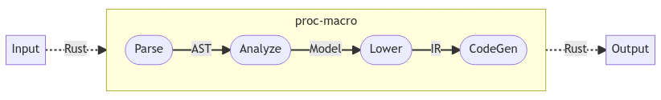

# minitrace-macro

[](https://docs.rs/minitrace-macro/)
[](https://crates.io/crates/minitrace-macro)
[](https://github.com/tikv/minitrace-rust/blob/master/LICENSE)

Provides an attribute-macro `trace` to help get rid of boilerplate.

## Usage

### Parameters

- `name`: Spans are generally named, by convention, using the string given as
  the first argument: `#[trace( name = "my_name")]`.  These names ***must*** adhere to
  Rust function name conventions.  If a name is not given, the name of the
  function being traced is used: `#[trace] fn f(){}` is equivalent to
  `#[trace( name = "f")] fn f(){}`.
- `enter_on_poll`: Applies only to `async` functions.

### Dependency

```toml
[dependencies]
minitrace = "0.4" # minitrace-macro is within minitrace::prelude
```

### Synchronous Function

```rust
use minitrace::prelude::*;

#[trace( name = "foo")]
fn foo() {
    // function body
}

// ** WILL BE TRANSLATED INTO: **
//
// fn foo() {
//     let __guard = LocalSpan::enter_with_local_parent("foo");
//     {
//         // function body
//     }
// }
```

### Asynchronous Function

```rust
use minitrace::prelude::*;

#[trace( name = "bar")]
async fn bar() {
    // function body
}

// ** WILL BE TRANSLATED INTO: **
//
// fn bar() -> impl core::future::Future<Output = ()> {
//     async {
//         // function body
//     }
//     .in_span(Span::enter_with_local_parent("bar"))
// }


#[trace( name = "qux", enter_on_poll = true)]
async fn qux() {
    // function body
}

// ** WILL BE TRANSLATED INTO: **
//
// fn qux() -> impl core::future::Future<Output = ()> {
//     async {
//         // function body
//     }
//     .enter_on_poll("qux")
// }
```

### ⚠️ Local Parent Needed

A function instrumented by `trace` always require a local parent in the context. Make sure that the caller is within the scope of `Span::set_local_parent()`.

```rust
use minitrace::prelude::*;

#[trace( name = "foo")]
fn foo() {}

#[trace( name = "bar")]
async fn bar() {}

let (root, collector) = Span::root("root");

{
    foo(); // This `foo` will __not__ be traced.
}

{
    let _g = root.set_local_parent();
    foo(); // This `foo` will be traced.
}

{
    runtime::spawn(bar()); // This `bar` will __not__ be traced.
}

{
    let _g = root.set_local_parent();
    runtime::spawn(bar()); // This `bar` will be traced.
}
```

## Developers

NOTE: A nightly compiler is required for the macro expansion tests

This Crate adapts the [Ferrous Systems](https://ferrous-systems.com/blog/testing-proc-macros/)
proc-macro pipeline:

<!--

```mermaid
flowchart LR;
    subgraph M[proc-macro-attribute]
      direction LR
        P([Parse])--AST->A([Analyze])--Model->L([Lower])--IR->C([CodeGen])
    end
    Input-. Rust .->M-. Rust .->Output;
```

-->



### Pipeline Stages

1. **Validate:** Validate the parsed user input, which are Rust tokens
   ([`TokenStream`]), into an a `syn::Item`. The [syn crate] does the parsing.
   Invalid macro arguments will trigger an error and exit.  Hereafter, code
   should be able to proceed under the assumption each parameter value is valid
   and their combination of values is valid too.
1. **Analyze:** Map the [`TokenStream`] into the proc-macro "domain model",
   that is, into types that reflect the Minitrace semantics.
1. **Lower:**  Transform the "domain model" into a "intermediate representation"
   (IR), ready for the generate stage.
1. **Generate:** Turn the IR into Rust tokens, [`TokenStream`]. These tokens
   are actual [`proc_macro2`] tokens which are then converted [`Into`] the
   required [`proc_macro`] tokens.

### Tests

To see a list of all tests:

```bash
pushd minitrace-macro
    cargo test -- --list
popd
```

To run an individual test suite, say the `ui` suite:

```bash
cargo test ui -- --nocapture
```

#### Test Suites

- `ui`:
- ``:

#### Generated code tests

NOTE: A nightly compiler is required for the macro expansion tests

The cargo expand tool must be present. You can install it via cargo:

```bash
cargo install cargo-expand
```

https://rust-lang.github.io/async-book/02_execution/02_future.html
